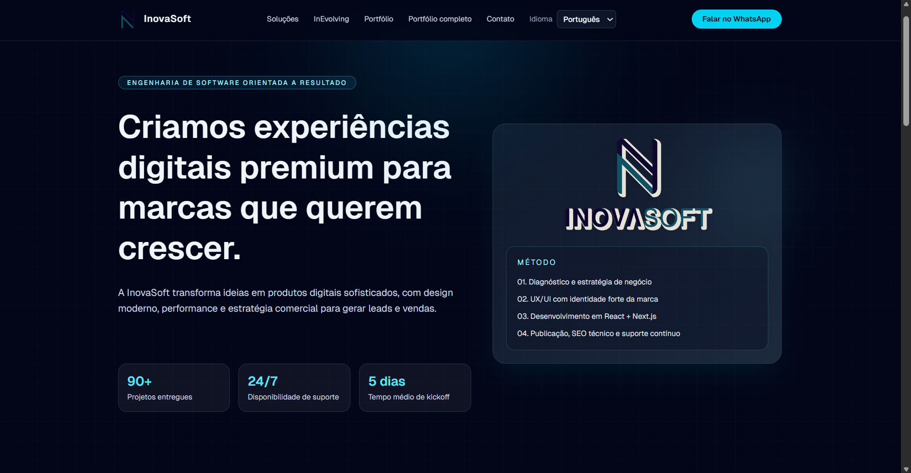
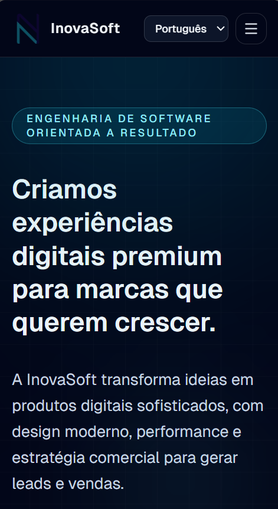
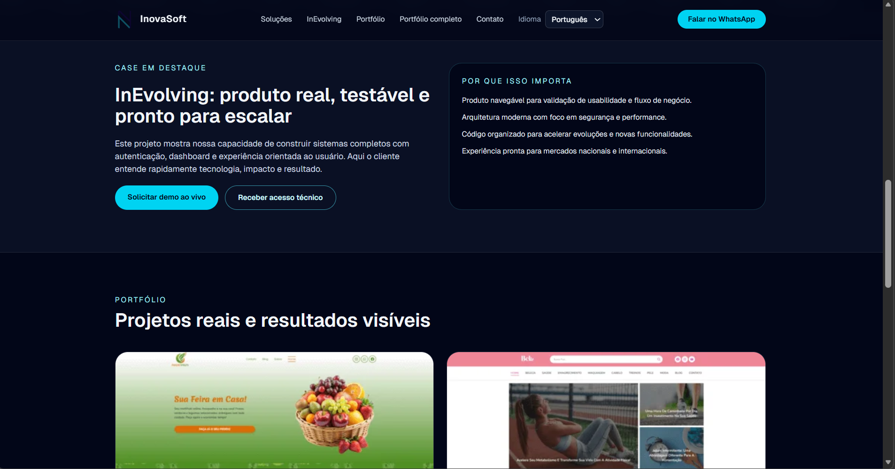
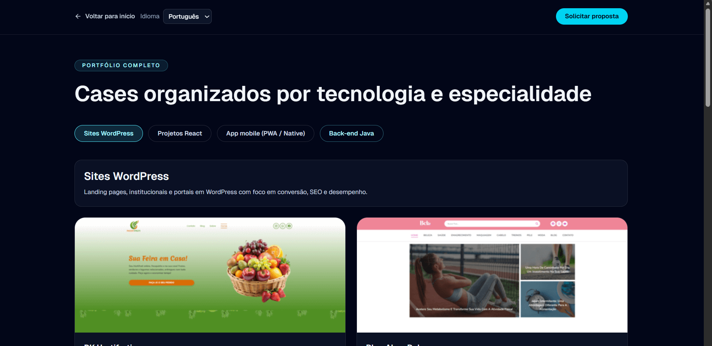
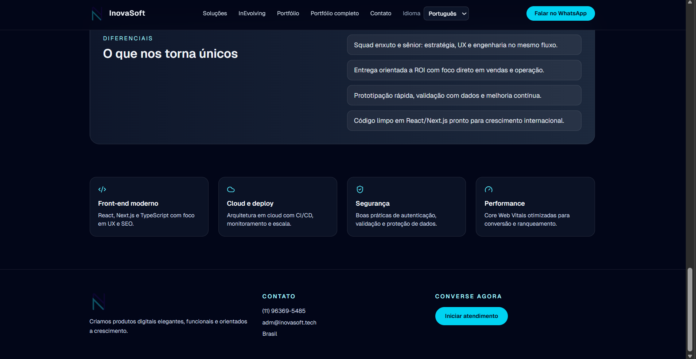

# InovaSoft Web — Presença digital que converte visitantes em oportunidades

## Slogan

**Sites e produtos digitais com performance, clareza e escala — do primeiro clique ao contato no WhatsApp.**

---

## Introdução e visão geral

### O problema

Empresas de tecnologia e software precisam **comunicar credibilidade em segundos**: explicar o que fazem, mostrar entregas reais e facilitar o próximo passo (contato ou demonstração). Muitos sites corporativos falham por excesso de texto técnico, navegação confusa em mobile ou ausência de prova social visual — e o visitante sai antes de entender o valor.

### A solução

**InovaSoft Web** é uma aplicação front-end moderna que apresenta a marca **InovaSoft**, suas soluções, o produto **InEvolving**, um portfólio curado por categoria e canais de contato direto. A experiência foi pensada para **landing page de alta conversão**: hierarquia visual clara, animações que guiam a atenção (sem poluir), internacionalização e exportação estática para deploy simples e rápido.

### Benefícios para o negócio e para o usuário final

| Para o negócio | Para o visitante |
|----------------|------------------|
| Narrativa comercial organizada em seções objetivas | Entendimento rápido do que a empresa entrega |
| Destaque de cases com links para projetos ao vivo | Confiança ao ver trabalhos reais |
| CTAs para WhatsApp e demonstrações | Caminho curto até falar com alguém |
| Suporte a múltiplos idiomas | Experiência no idioma preferido |
| Base técnica atual (React, Next.js) | Carregamento e interação fluidos em desktop e mobile |

---

## Funcionalidades principais

1. **Hero com impacto e métricas animadas**  
   Apresenta a proposta de valor logo no topo, com contadores que reforçam números-chave (entregas, suporte, prazos). *Valor:* primeira impressão profissional e memorável.

2. **Seção de soluções em cards**  
   Três pilares de oferta explicados de forma direta. *Valor:* alinha expectativa do cliente com o que a empresa realmente vende.

3. **Faixa de tecnologias (marquee)**  
   Exibe o stack e temas como SEO de forma contínua. *Valor:* posiciona a marca como atualizada e versátil sem sobrecarregar o layout.

4. **Destaque do produto InEvolving**  
   Bloco dedicado com chamadas para demonstração e acesso, além de “por que escolher”. *Valor:* funil claro para produto próprio, não só serviços.

5. **Portfólio na home e página completa**  
   Na home, grid com imagens e links para projetos; na rota `/portfolio`, abas por categoria (WordPress, React, mobile, backend Java) com metadados de stack e URLs. *Valor:* prova social escalável e fácil de manter via dados centralizados.

6. **Diferenciais e cards de expertise**  
   Lista de diferenciais e quatro cartões (frontend, cloud, segurança, performance). *Valor:* reforça competências sem depender só do texto do hero.

7. **Navegação responsiva e acessível**  
   Menu desktop, menu mobile com overlay, âncoras para seções e rota internacionalizada. *Valor:* usabilidade em qualquer dispositivo.

8. **Internacionalização (i18n)**  
   Conteúdos traduzidos via `next-intl`, com troca de idioma visível no header. *Valor:* alcance internacional e demonstração de boa prática em apps multilíngues.

9. **Integração com WhatsApp**  
   Botões estratégicos para abrir conversa com número configurado. *Valor:* reduz fricção entre interesse e contato humano.

10. **Rodapé institucional**  
    Logo, tagline, telefone, e-mail e CTA. *Valor:* fecha a página com confiança e dados oficiais.

11. **Metadados SEO na página de portfólio**  
    Título e descrição gerados por tradução por locale. *Valor:* melhor preparação para indexação e compartilhamento.

---

## Tecnologias utilizadas

| Camada | Tecnologias |
|--------|-------------|
| **Linguagem** | TypeScript |
| **Framework UI** | React 19 |
| **Framework full-stack / rotas** | Next.js 16 (App Router) |
| **Estilização** | Tailwind CSS 4 |
| **Animações** | Framer Motion |
| **Ícones** | Lucide React |
| **Internacionalização** | next-intl |
| **Qualidade de código** | ESLint, `eslint-config-next` |
| **Build** | Export estático (`output: "export"`), React Compiler habilitado |

**Por que algumas escolhas importam**

- **Next.js + App Router:** rotas por segmento, layouts e componentes server/client onde faz sentido, alinhado ao mercado em 2025–2026.  
- **TypeScript:** contratos explícitos para dados do portfólio e props, menos regressões em evolução do site.  
- **next-intl:** separação limpa entre código e mensagens, escalável para novos idiomas.  
- **Framer Motion:** microinterações e entrada em viewport com controle fino, elevando percepção de qualidade.  
- **Export estático:** hospedagem em CDN ou qualquer bucket estático, com custo e complexidade operacional reduzidos.

> *Nota:* O conteúdo da home cita ecossistemas como Node.js, PostgreSQL, Prisma, AWS, Docker e CI/CD como parte da narrativa da marca; o código deste repositório é focado no front-end listado acima.

---

## Demonstração visual

 *← Hero completo (desktop)*
 *← Hero e menu mobile aberto*
 *← Seção de portfólio na home*
 *← Página /portfolio com abas*
 *← Rodapé e CTAs*

### GIF ou vídeo *(opcional)*

- **GIF:** grave um walkthrough de 15–30 s (scroll + troca de idioma + abertura do menu mobile). Salve como `docs/demo/walkthrough.gif`.  
- **Vídeo:** hospede no YouTube ou Loom e troque o link abaixo.

```markdown
[](https://www.youtube.com/watch?v=SEU_VIDEO_ID)
```

---

## Como executar / instalar

### Pré-requisitos

- **Node.js** 20.x ou superior (recomendado: LTS atual)  
- **npm** (vem com o Node) ou **pnpm** / **yarn**, se preferir adaptar os comandos

### Passo a passo

1. **Clone o repositório** (se ainda não tiver localmente):

```bash
git clone <url-do-repositorio>
cd web-react-inovasoft
```

2. **Entre na pasta da aplicação:**

```bash
cd inovasoft-website
```

3. **Instale as dependências:**

```bash
npm install
```

4. **Suba o ambiente de desenvolvimento:**

```bash
npm run dev
```

5. Abra o navegador em **http://localhost:3000** (ou a URL exibida no terminal).

### Build de produção e site estático

O projeto está configurado para **export estático** (`output: "export"`).

```bash
npm run build
```

Os arquivos gerados ficam na pasta **`out/`**. Você pode servir essa pasta com qualquer servidor estático ou publicar em GitHub Pages, S3, Netlify, Vercel (modo estático), etc.

Para testar o build localmente após gerar `out/`:

```bash
npx serve out
```

### Scripts disponíveis

| Comando | Descrição |
|---------|-----------|
| `npm run dev` | Servidor de desenvolvimento |
| `npm run build` | Build + export estático para `out/` |
| `npm run start` | Servidor Next em modo *standalone* (quando aplicável; com export, use `serve` no `out/`) |
| `npm run lint` | Verificação ESLint |

---
---

## Agradecimentos *(opcional)*

- Comunidades **Next.js**, **React** e **Tailwind CSS** pela documentação e ecossistema.  
---

## Contato

**InovaSoft (projeto / empresa)**  
- **WhatsApp:** [+55 11 96369-5485](https://api.whatsapp.com/send/?phone=%2B5511963695485)  
- **E-mail:** adm@inovasoft.tech  
- **País:** Brasil  

**Autor do portfólio**

- **LinkedIn:** `https://www.linkedin.com/in/victor-teixeira-354a131a3/`  
- **GitHub:** `https://github.com/victorteixeirasilva`  
- **E-mail pessoal:** `victor.teixeira@inovasoft.tech`  

---
